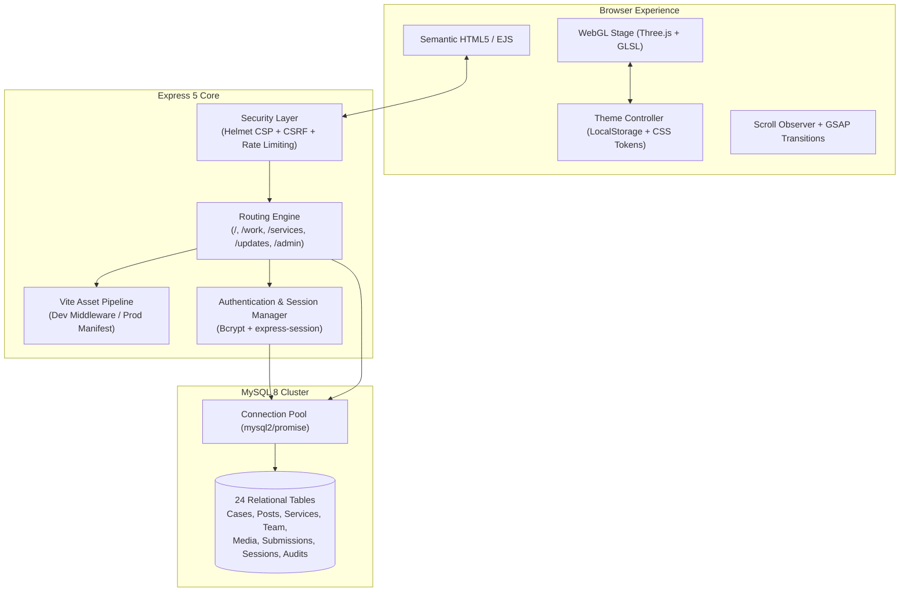

<div align="center">

```
  ██████╗ ███████╗██╗   ██╗ ██████╗███████╗███╗   ██╗████████╗███████╗██████╗ ██████╗  ██████╗ ██╗███╗   ██╗████████╗
  ██╔══██╗██╔════╝██║   ██║██╔════╝██╔════╝████╗  ██║╚══██╔══╝██╔════╝██╔══██╗██╔══██╗██╔═══██╗██║████╗  ██║╚══██╔══╝
  ██║  ██║█████╗  ██║   ██║██║     █████╗  ██╔██╗ ██║   ██║   █████╗  ██████╔╝██████╔╝██║   ██║██║██╔██╗ ██║   ██║   
  ██║  ██║██╔══╝  ╚██╗ ██╔╝██║     ██╔══╝  ██║╚██╗██║   ██║   ██╔══╝  ██╔══██╗██╔═══╝ ██║   ██║██║██║╚██╗██║   ██║   
  ██████╔╝███████╗ ╚████╔╝ ╚██████╗███████╗██║ ╚████║   ██║   ███████╗██║  ██║██║     ╚██████╔╝██║██║ ╚████║   ██║   
  ╚═════╝ ╚══════╝  ╚═══╝   ╚═════╝╚══════╝╚═╝  ╚═══╝   ╚═╝   ╚══════╝╚═╝  ╚═╝╚═╝      ╚═════╝ ╚═╝╚═╝  ╚═══╝   ╚═╝   
```

### Software that survives contact with production.
*Engineered for teams that need systems to hold up under real-world pressure — and still make sense to the engineer who inherits them.*

---

[](https://nodejs.org)
[](https://expressjs.com)
[](https://threejs.org)
[](https://vitejs.dev)
[](https://mysql.com)
[](#security-suite)
[](LICENSE)

[Live Demo](#quick-start) • [Visual Architecture](#visual-architecture) • [Design System](#visual-design-system) • [Security Audit](#security-suite) • [cPanel Deployment Guide](CPANEL_DEPLOYMENT_GUIDE.md)

</div>

---

## Executive Overview

**DevCenterPoint** is an enterprise-grade digital flagship combining a **high-precision 3D WebGL storytelling stage** with a **bespoke, fully relational Content Management System (CMS)** backed by **MySQL 8**.

Unlike generic templates built on bloated third-party monoliths, DevCenterPoint is engineered from first principles:
- **Zero Framework Bloat**: Pure, ultra-fast server-side rendering with Express 5, EJS, and componentized HTML.
- **Unified Pipeline**: Vite runs in middleware mode during development for sub-millisecond Hot Module Replacement (HMR) and compiles to fingerprint-hashed, immutable static bundles for production.
- **Industrial 3D Graphics**: A dynamic 22,000-particle WebGL constellation rendered with custom GLSL shaders, breathing geometric cages, and real-time scroll velocity responsiveness.
- **Relational Integrity**: Complete MySQL schema with strict constraints, foreign keys, prepared statements, and transaction safety.
- **Dual Visual Personality**: Flawless system-wide Dark and Light modes with zero flash of unstyled theme (No-FOUT) and cross-tab synchronization.

---

## Visual Architecture



---

## Visual Design System & Aesthetics

The visual language balances the cold authority of an engineering terminal with the typographic sophistication of an architectural monograph.

### 1. Dual Color Personalities

| Mode | Visual Identity | Background | Primary Surface | Brand Signal | Accent Ink |
| :--- | :--- | :--- | :--- | :--- | :--- |
| **Dark Mode** | *Obsidian Carbon* | `#07090E` | `#0C101A` | Electric Cobalt (`#2563EB`) | Luminous Cyan (`#38BDF8`) |
| **Light Mode** | *Architectural Blueprint*| `#F8FAFC` | `#FFFFFF` | Royal Cobalt (`#1D4ED8`) | Slate Sapphire (`#0284C7`) |

### 2. The 3D Holographic Stage (`src/three/scene.js`)
- **Particle Core**: 22,000 mathematically generated points morphing across eight narrative geometry chapters (`shards`, `scatter`, `converge`, `build`, `name`, `leap`, `merge`, `expand`).
- **Dynamic Blending Adaptation**:
  - **Dark Mode**: Uses `THREE.AdditiveBlending` for an ethereal, luminous bloom against the obsidian abyss.
  - **Light Mode**: Dynamically switches to `THREE.NormalBlending` with calibrated point sizes and deep cobalt inks, rendering the scene as a crisp, technical blueprint hologram without washing out.
- **Nested Architecture Cage**: Dual counter-rotating icosahedron wireframes framing the core cloud to symbolize structured, scalable software architecture.
- **Singularity & Filaments**: Real-time radial energy bloom with 6 orbiting team-nodes connected by dynamic energy filament bonds that flex with scroll velocity.

### 3. Typographic Hierarchy
- **Display Headlines**: *Archivo* (`font-weight: 700`) — Industrial, assertive geometric grotesk.
- **Body & Structural Text**: *IBM Plex Sans* — Technical readability crafted by IBM for engineering excellence.
- **Editorial Emphasis & Quotes**: *Instrument Serif* — Warm, human, italic contrast reflecting thoughtful craftsmanship.
- **Code, Numbers & Badges**: *IBM Plex Mono* — Monospaced clarity for technical metadata and timestamps.

---

## Full Feature Matrix

### Public Marketing Experience
- **Interactive Storytelling Hero**: Scroll-synchronized 3D core that reacts to cursor movement and scroll velocity.
- **Case Studies Portfolio (`/work`)**: Categorized project retrospectives with metrics, engineering challenges, architecture diagrams, and client testimonials.
- **Services Catalog (`/services`)**: Detailed engineering disciplines with clear deliverables, scope calculators, and engagement models.
- **Newsfeed & Company Updates (`/updates`)**: Chronological changelog and company announcements with category filtering and version tags.
- **Company Manifesto (`/about`)**: Team profiles, founding philosophy, architectural principles, and career opportunities.
- **Instant Project Estimator & Contact (`/contact`)**: Interactive scope calculator with budget selection, honeypot spam protection, and rate-limited dispatch.
- **Command Palette (`⌘K` / `Ctrl+K`)**: Instant system-wide search across services, case studies, insights, and quick navigation.
- **System Telemetry Status (`/status`)**: Public health dashboard showcasing live database response times, memory metrics, and service status.

### Administrator Control Suite (`/admin`)
- **Executive Dashboard**: Real-time counters, lead telemetry, and instant shortcuts.
- **Case Studies Manager**: Full WYSIWYG/Markdown editor with multi-metric inputs, technology stack tags, and cover image picker.
- **Insights & Blog Studio**: Rich content publishing with tag management, draft/publish workflows, and SEO metadata.
- **Services Manager**: Manage disciplines, deliverables, sort orders, and homepage feature toggles.
- **Media Library**: Upload and manage assets with automatic thumbnailing, file size calculation, and alt-text assignment.
- **Company Updates Manager**: Publish version releases and milestones directly to the public `/updates` feed.
- **Contact Submissions Inbox**: Review inquiries, filter by unread status, inspect referrers, and manage leads.
- **Navigation & Settings Builder**: Modify global navigation links, social URLs, meta descriptions, and contact info without code changes.
- **Immutable Security Audit Log**: Tracks every administrative action with timestamp, admin ID, IP, and affected record.

---

## Security Suite & Audit Hardening

DevCenterPoint implements multi-layered defensive security:

```
[ Incoming Request ]
        │
        ▼
[ 1. Reverse Proxy Trust ] ───────► 'trust proxy' configured for HTTPS/X-Forwarded-Proto
        │
        ▼
[ 2. Rate Limiting ] ─────────────► Brute-force protection on /admin/login & /contact
        │
        ▼
[ 3. Helmet Security Headers ] ───► Strict CSP with dynamic cryptographic nonces
        │                           X-Frame-Options: DENY, X-Content-Type-Options: nosniff
        ▼
[ 4. Session & Cookie Shield ] ──► MySQL-backed sessions, HttpOnly, SameSite=Lax, Secure
        │
        ▼
[ 5. CSRF Protection ] ──────────► Cryptographic double-check tokens on all mutating operations
        │
        ▼
[ 6. File Upload Hardening ] ─────► Strict MIME + extension whitelist, executable blacklist,
        │                           uploads directory .htaccess script-execution disable
        ▼
[ 7. SQL Injection Prevention ] ──► mysql2/promise server-side parameterized prepared statements
        │
        ▼
[ 8. Zero Information Leak ] ────► 500 stack traces logged to server only, never exposed to clients
```

1. **Strict File Upload Isolation**: Uploads only allow verified image and PDF MIME types. Executable extensions (`.php`, `.phtml`, `.cgi`, `.sh`, `.exe`, etc.) are blocked by code and restricted by Apache `.htaccess`.
2. **Brute-Force Rate Limiting**: `/admin/login` allows a maximum of 5 failed attempts per 15 minutes per IP before issuing HTTP 429. User accounts auto-lock upon repeated failures.
3. **Prepared SQL Statements**: 100% of user queries utilize `pool.execute(sql, [params])` to guarantee immunity against SQL injection.
4. **Session Resilience**: Stored securely in MySQL with 2-hour rolling expiration and automatic session regeneration upon authentication.

---

## Quick Start & Local Development

### Prerequisites
- **Node.js**: v20.x or v22.x LTS ([Download](https://nodejs.org))
- **MySQL**: 8.0+ ([Laragon](https://laragon.org) recommended for Windows, or native MySQL/Docker)
- **Git**

### Installation

1. **Clone the repository**:
   ```bash
   git clone https://github.com/beingmushfiq/DevCenterPoint.git
   cd DevCenterPoint
   ```

2. **Install dependencies**:
   ```bash
   npm install
   ```

3. **Configure Environment Variables**:
   Copy the example configuration:
   ```bash
   cp .env.example .env
   ```
   Edit `.env` with your database credentials:
   ```ini
   PORT=3000
   SITE_URL=http://localhost:3000

   DB_HOST=127.0.0.1
   DB_PORT=3306
   DB_USER=root
   DB_PASSWORD=
   DB_NAME=devcenterpoint_cms
   DB_POOL_SIZE=10

   SESSION_SECRET=create-a-secure-random-string-at-least-32-chars
   ADMIN_EMAIL=admin@devcenterpoint.com
   ADMIN_PASSWORD=SetYourAdminPassword123!
   ADMIN_NAME=Administrator
   ```

4. **Initialize Database & Seed Content**:
   ```bash
   # Creates database schema, runs migrations, and seeds demonstration content
   npm run db:setup
   ```

5. **Start Development Server**:
   ```bash
   npm run dev
   ```
   Open your browser to:
   - **Public Site**: [http://localhost:3000](http://localhost:3000)
   - **Admin Portal**: [http://localhost:3000/admin/login](http://localhost:3000/admin/login)

---

## Production Deployment

### Standard Production Build
```bash
# 1. Compile optimized client assets
npm run build

# 2. Launch production server
npm start
```

### Deployment Guides
- **cPanel Shared/VPS Hosting**: See the complete, step-by-step [cPanel Deployment Guide](CPANEL_DEPLOYMENT_GUIDE.md) for Phusion Passenger setup, database configuration, `.htaccess` rules, and AutoSSL.
- **Docker / Cloud VPS**: Run behind Nginx or Caddy with `NODE_ENV=production npm start`.

---

## CLI & NPM Scripts

| Command | Action |
| :--- | :--- |
| `npm run dev` | Boots Express server with Vite middleware & live HMR on port 3000 |
| `npm run build` | Bundles, minifies, and hashes client assets into `dist/` |
| `npm start` | Launches server in optimized production mode (`--prod`) |
| `npm run preview` | Runs the production bundle locally for staging review |
| `npm run db:setup` | Creates database, applies all migrations, and seeds sample data |
| `npm run db:migrate` | Runs unapplied SQL migrations from `migrations/` idempotently |
| `npm run db:seed` | Seeds or re-seeds initial data into tables |

---

## Project Structure

```
devcenterpoint/
├── app.js                   # Universal startup file (cPanel / Phusion Passenger)
├── server/                  # Backend Application Architecture
│   ├── index.js             # Express bootstrap & middleware configuration
│   ├── config.js            # Environment validation & fail-fast configuration
│   ├── db/                  # Database cluster
│   │   ├── pool.js          # MySQL connection pool & query helpers
│   │   ├── migrate.js       # Migration runner (schema_migrations)
│   │   ├── setup.js         # Interactive database initialization
│   │   └── seed.js          # Demonstration content generator
│   ├── lib/                 # Core utilities (assets manifest, html, markdown)
│   ├── middleware/          # Security, auth, CSRF, error & global filters
│   ├── models/              # Relational models (content.js, admin.js)
│   └── routes/              # Route controllers (public.js & admin sub-routers)
├── src/                     # Frontend Client Architecture
│   ├── entries/             # Vite bundle entry points (site.js, admin.js)
│   ├── styles/              # Design system tokens, typography, pages, admin
│   ├── three/               # WebGL engine (scene.js, GLSL shaders)
│   └── ui/                  # UI interactive controllers (theme, modal, motion)
├── views/                   # EJS Semantic Templates
│   ├── admin/               # Administrator portal views
│   ├── pages/               # Public marketing pages (home, work, services, updates)
│   └── partials/            # Reusable components (head, nav, foot, theme-toggle)
├── migrations/              # Incremental SQL migration scripts
├── public/                  # Static assets (brand, uploads, favicon.svg, .htaccess)
├── dist/                    # Compiled, fingerprinted production bundles
├── .htaccess                # Production Apache security & Passenger rules
└── package.json             # Dependencies & deployment scripts
```

---

## License & Credits

Built with precision by the **DevCenterPoint Engineering Team**.  
Released under the [MIT License](LICENSE).
